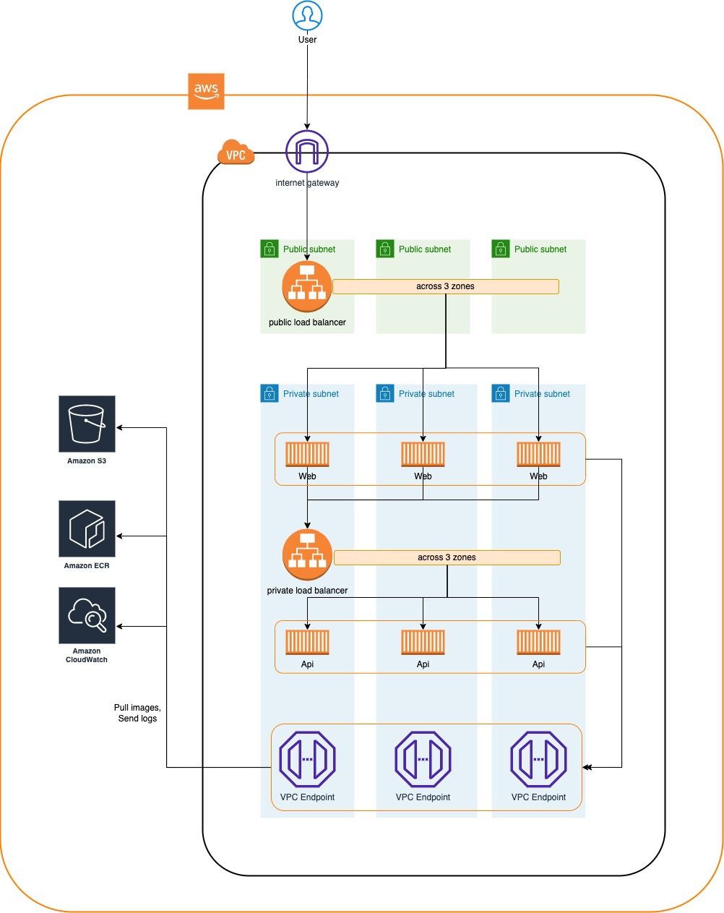

# useful command

```
# deploy stack
pulumi up

pulumi preview --diff

# destroy stack
pulumi destroy
```

## prerequisite

- pulumi
- docker
- aws cli

## configuration

Pulumi.dev.yaml

```yaml
config:
  aws:profile: <change_to_your_aws_named_profile>
  aws:region: us-east-1
  ...
```

named profile

```sh
aws configure --profile {named_profile}
```

## stack output

this stack output is a load balancer endpoint

```sh
Outputs:
    publicEndpoint: "http://{load-balancer-name}.{region}.elb.amazonaws.com"
```

## approach

this stack using simple approach which is 2 tier architecture: public and private tier

public tier:

- internet gateway
- public load balancer(internet-facing)

private tier:

- VPC endpoint
  - ecr
  - ecr-api
  - s3
  - logs
- private load balancer(internal-facing)
- ECS service
  - web
  - api

Scalability:

- both web and api has auto scaling policy
- each zone private subnet has 8000+ available ipv4 addresses

Availability:

- all services are across 3 AZs

## TODO

security:

- add WAF to public LB
- docker image scan

traceability:

- flowlog for VPC
- access log for LB

deployment:
- BlueGreen || Rolling
- rollback controller

# architecture overview

